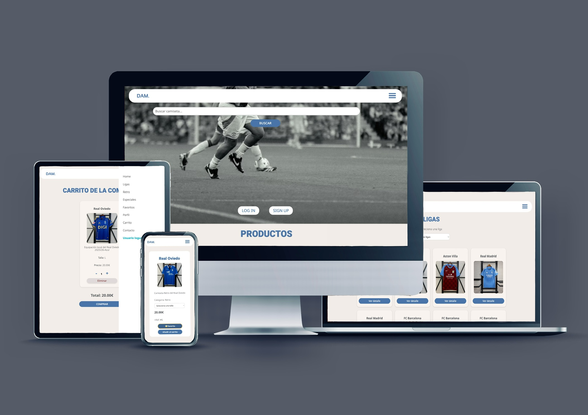

# Proyecto: Tienda Online de Camisetas de Fútbol ⚽️

 Este proyecto consiste en el desarrollo una **web completa de venta de camisetas**, abarcando tanto la parte de desarrollo **backend** como el **frontend**.

En el **backend**, se implementará una API con Node.js y Express, gestionando usuarios, productos, favoritos y órdenes de compra, con autenticación mediante JWT y validación de datos.

En el **frontend**, se construirá una interfaz interactiva y responsiva con **React**, permitiendo a los usuarios navegar por el catálogo, filtrar por tipo o liga, añadir camisetas a favoritos y gestionar su carrito de la compra.

Se integrará una **base de datos PostgreSQL** para almacenar usuarios, camisetas , pedidos y favoritos

El objetivo es ofrecer una **aplicación web completa y funcional**, combinando un backend robusto con un frontend moderno y dinámico.




## Tecnologías usadas 💻

- JavaScript
- SASS
- Frontend: React
- BBDD: PostgreSQL
- Backend: Express.js, Node.js
- Deploy: Render(API,BBDD SQL)????
- Autenticación: JWT

## Librerías 📕

- React
- Axios
- Jwt-decode
- React-burger-menu
- Normalize.css
- Sass
- Sweetalert2
- Vite
- Create-react-component-folder
- Express
- Cors
- Dotenv
- Cookie-parser
- Bcryptjs
- Jsonwebtoken
- Pg
- Swagger-jsdoc
- Swagger-ui-express
- Concurrently
- Nodemon

## 📄 Instrucciones
### 1. Clona el repositorio 

```bash
git clone https://github.com/luciaaroca/web_final.git
```

### 2. Instalar dependendias

```bash
npm install (Dependencias globales)

cd frontend
npm install (Dependencias frontend)

cd ../backend
npm install (Dependencia backend)
```

### 3. Configurar variables de entorno


```bash
Backend:
# BBDD remota
NODE_ENV=
DB_HOST=
DB_USER=
DB_DATABASE=
DB_PORT=
DB_PASSWORD=

# Json Web Token
MY_TOKEN_SECRET=
--------
Frontend
VITE_API_URL=
```
### 5. Iniciar el servidor:
```bash
- npm run dev --prefix backend
- npm run dev --prefix frontend
- npm run start:all -> para ambos
```

## Árbol de Componentes

    App --> App.jsx 
    Header 
        ->Nav--->  (links rutas)
           ->Home
           ->Favoritas
           ->Contacto
           ->Perfil
           ->Carrito
           ->Ligas
           ->Retro
           ->Especiales

    Main       
        ->CarritoList
            ->CarritoItem
        ->Contact
        ->EspecialContainer
            ->EspecialList
                ->EspecialItem
        ->FavoriteContainer
            ->FavoriteList
                ->FavoriteItem
        ->FavoriteDetail
       ->Home
            ->Search
            ->TshirtList
                ->TshirtItem
        ->LigasContainer
            ->LigaList
                ->LigaItem
        ->LogIn
            ->LogInForm
        ->Profile
        ->RetroContainer
           ->RetroList
                ->RetroItem
        ->SignUp
            ->SignUpForm
        ->TshirtDetail

## Lecciones aprendidas💡

- Crear nuestra API con Node.js y Express.
- Crear endpoints de BBDD PostgreSQL.
- Trabajar con React y sus Componentes.
- Uso de librerías.
- Estilos con SASS.
- Autenticación con JWT.

## Funcionalidades futuras 🗒️

- Agregar una pasarela de pago a la parte del carrito de la compra.
- Añadir todos los productos disponibles.

## Autor 👩🏽‍💻

- Nombre: Lucía Aroca Solís
- LinkedIn: linkedin.com/in/lucía-aroca-solís-b652552b4/?skipRedirect=true
- GitHub: https://github.com/luciaaroca/web_final.git

